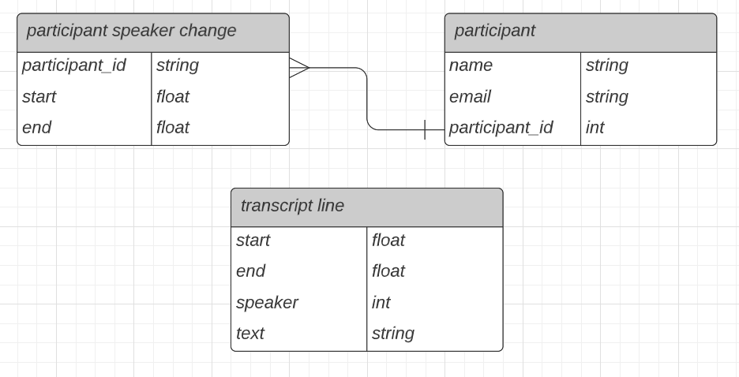

# Technical Interview Challenge #2

## Purpose
The purpose of this interview challenge is to assess your coding ability. While the role of a software engineer involves plenty of non-coding skills, coding is an essential part of the job that you need to do reasonably well. 

## Context
This coding challenge is a simplified version of a problem that we've had to solve at BuildBetter. 

BuildBetter Research is a tool that records and transcribes user interviews conducted via Zoom meetings.

After a meeting is recorded, we submit the video to an external transcription service that runs speech-to-text. In addition to generating text, the transcription service predicts which segments of the video correspond to distinct speakers in the video. A transcript line is a tuple of `(start, end, speaker, text)` where `start` and `end` are the bounds of the line in seconds from the start of the video, `speaker` is numeric label for a distinct predicted speaker, and `text` is what was spoken. These are recorded in the `transcript line` table.

While the meeting is running, Zoom sends BuildBetter two types of events:
1. "Participant Joined" events: tuples of `(name, email, participant_id)` of participants that join a zoom meeting. `participant_id` is unique for each joined participant. These are recorded in the `participant` table.
2. "Participant Speaker Change" events: tuples of `(participant_id, start, end)` that correspond to when the Zoom client detects a change in the current active speaker. These are recorded in the `participant speaker change` table.

## Challenge
Given the above context, **infer which transcript speakers correspond to which participants**. Participants can be identified by `email` or `participant_id`. You can find all of the above data in the file clean_data.json.

You can choose whatever language you prefer, and the expected output is a list of lines that follow the formatting: `<name>: <list of transcript speakers>`. 

If you choose Python, feel free to use the class `utils.schemas.CleanData` to read the clean data file by calling: `CleanData.parse_file('data/clean_data.json')`

Testing and documentation are recommended. 

Hints:
- there is a many-to-one relationship between unique transcript speakers and participants
- the overlapping algorithm for two ranges (a, b) and (c, d) is: 

  `max(min(b, d) - max(a, c), 0)`
